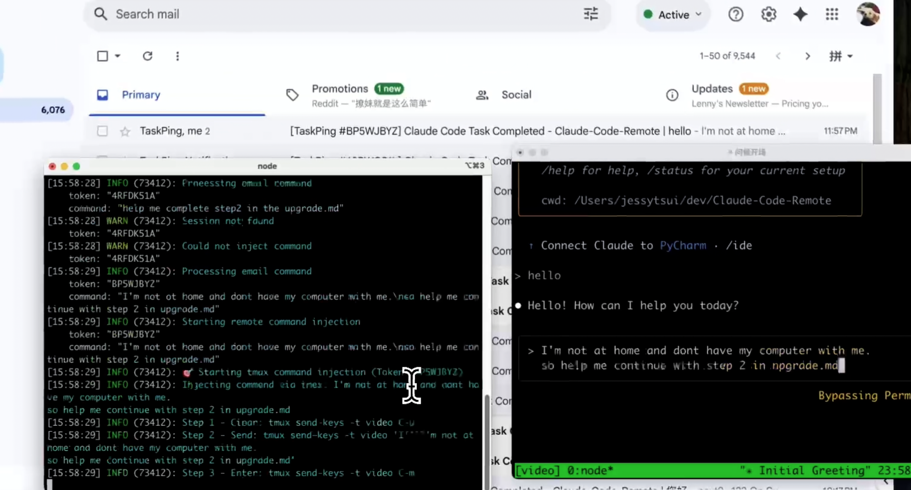

# Claude Code Remote

Control [Claude Code](https://claude.ai/code) remotely via multiple messaging platforms. Start tasks locally, receive notifications when Claude completes them, and send new commands by simply replying to messages.

**Supported Platforms:**
- 📧 **Email** - Traditional SMTP/IMAP integration
- 📱 **Telegram** - Interactive bot with smart buttons ✅ **COMPLETED**  
- 💬 **LINE** - Rich messaging with token-based commands
- 🖥️ **Desktop** - Sound alerts and system notifications

<div align="center">
  
  ### 🎥 Watch Demo Video
  
  <a href="https://youtu.be/_yrNlDYOJhw">
    
    <br>
    
  </a>
  
</div>

> 🐦 Follow [@Jiaxi_Cui](https://x.com/Jiaxi_Cui) for updates and AI development insights

## 📅 Changelog

### August 2025
**2025-08-01: Enhanced Multi-Channel Notification System** (by @laihenyi @JessyTsui)
- ✅ **Telegram Integration Completed** - Interactive buttons, real-time commands, smart personal/group chat handling
- ✅ **Multi-Channel Notifications** - Simultaneous delivery to Desktop, Telegram, Email, LINE
- ✅ **Smart Sound Alerts** - Always-on audio feedback with customizable sounds
- ✅ **Intelligent Session Management** - Auto-detection, real conversation content, 24-hour tokens

**2025-08-01: Implement terminal-style UI for email notifications** (#8 by @vaclisinc)

**2025-08-01: Fix working directory issue - enable claude-remote to run from any directory** (#7 by @vaclisinc)

### July 2025
**2025-07-31: Fix self-reply loop issue when using same email for send/receive** (#4 by @vaclisinc)

**2025-07-28: Remove hardcoded values and implement environment-based configuration** (#2 by @kevinsslin)

## 📋 TODO List

### Notification Channels
- ~~**📱 Telegram Integration**~~ ✅ **COMPLETED** - Bot integration with interactive buttons and real-time commands
- **💬 Discord Integration** - Bot integration for messaging platforms
- **⚡ Slack Workflow** - Native Slack app with slash commands

### Developer Tools
- **🤖 AI Tools Support** - Integration with Gemini CLI, Cursor, and other AI development tools
- **🔀 Git Automation** - Auto-commit functionality, PR creation, branch management

### Usage Analytics
- **💰 Cost Tracking** - Token usage monitoring and estimated costs
- **⚡ Performance Metrics** - Execution time tracking and resource usage analysis
- **📧 Scheduled Reports** - Daily/weekly usage summaries delivered via email

### Native Apps
- **📱 Mobile Apps** - iOS and Android applications for remote Claude control
- **🖥️ Desktop Apps** - macOS and Windows native clients with system integration

## ✨ Features

- **📧 Multiple Messaging Platforms**: 
  - Email notifications with reply-to-send commands
  - Telegram Bot with interactive buttons and slash commands ✅ **NEW**
  - LINE messaging with token-based commands
  - Desktop notifications with sound alerts ✅ **NEW**
- **🔄 Two-way Control**: Reply to messages or emails to send new commands
- **📱 Remote Access**: Control Claude from anywhere
- **🔒 Secure**: ID-based whitelist verification for all platforms
- **👥 Group Support**: Use in LINE groups or Telegram groups for team collaboration
- **🤖 Smart Commands**: Intuitive command formats for each platform
- **📋 Multi-line Support**: Send complex commands with formatting
- **⚡ Smart Monitoring**: Intelligent detection of Claude responses with historical tracking
- **🔄 tmux Integration**: Seamless command injection into active tmux sessions

## 🚀 Quick Start

### 1. Prerequisites

**System Requirements:**
- Node.js >= 14.0.0
- **tmux** (required for command injection)
- Active tmux session with Claude Code running

### 2. Install

```bash
git clone https://github.com/JessyTsui/Claude-Code-Remote.git
cd Claude-Code-Remote
npm install
```

### 3. Choose Your Platform

#### Option A: Configure Email (Recommended for Beginners)

```bash
# Copy example config
cp .env.example .env

# Edit with your email credentials
nano .env
```

**Required email settings:**
```env
EMAIL_ENABLED=true
SMTP_USER=your-email@gmail.com
SMTP_PASS=your-app-password
IMAP_USER=your-email@gmail.com  
IMAP_PASS=your-app-password
EMAIL_TO=your-notification-email@gmail.com
ALLOWED_SENDERS=your-notification-email@gmail.com
SESSION_MAP_PATH=/your/path/to/Claude-Code-Remote/src/data/session-map.json
```

📌 **Gmail users**: Use [App Passwords](https://myaccount.google.com/security), not your regular password.

#### Option B: Configure Telegram ✅ **NEW**

**Quick Setup:**
```bash
chmod +x setup-telegram.sh
./setup-telegram.sh
```

**Manual Setup:**
1. Create bot via [@BotFather](https://t.me/BotFather)
2. Get your Chat ID from bot API
3. Configure webhook URL (use ngrok for local testing)

**Required Telegram settings:**
```env
TELEGRAM_ENABLED=true
TELEGRAM_BOT_TOKEN=your-bot-token-here
TELEGRAM_CHAT_ID=your-chat-id-here
TELEGRAM_WEBHOOK_URL=https://your-ngrok-url.app
SESSION_MAP_PATH=/your/path/to/Claude-Code-Remote/src/data/session-map.json
```

#### Option C: Configure LINE

**Required LINE settings:**
```env
LINE_ENABLED=true
LINE_CHANNEL_ACCESS_TOKEN=your-token
LINE_CHANNEL_SECRET=your-secret
LINE_USER_ID=your-user-id
```

### 4. Configure Claude Code Hooks

Create hooks configuration file:

**Method 1: Global Configuration (Recommended)**
```bash
# Add to ~/.claude/settings.json
{
  "hooks": {
    "Stop": [{
      "matcher": "*",
      "hooks": [{
        "type": "command",
        "command": "node /your/path/to/Claude-Code-Remote/claude-hook-notify.js completed",
        "timeout": 5
      }]
    }],
    "SubagentStop": [{
      "matcher": "*",
      "hooks": [{
        "type": "command",
        "command": "node /your/path/to/Claude-Code-Remote/claude-hook-notify.js waiting",
        "timeout": 5
      }]
    }]
  }
}
```

**Method 2: Project-Specific Configuration**
```bash
# Set environment variable
export CLAUDE_HOOKS_CONFIG=/your/path/to/Claude-Code-Remote/claude-hooks.json
```

**Note**: Replace `/your/path/to/Claude-Code-Remote` with your actual project path.

### 5. Start Services

#### For All Platforms (Recommended)
```bash
# Automatically starts all enabled platforms
npm run webhooks
# or
node start-all-webhooks.js
```

#### For Individual Platforms

**For Email:**
```bash
npm run daemon:start
# or
node claude-remote.js daemon start
```

**For Telegram:**
```bash
npm run telegram
# or
node start-telegram-webhook.js
```

**For LINE:**
```bash
npm run line
# or
node start-line-webhook.js
```

### 6. Test Your Setup

**Quick Test:**
```bash
# Test all notification channels
node claude-hook-notify.js completed
# Should receive notifications via all enabled platforms
```

**Full Test:**
1. Start Claude in tmux session with hooks enabled
2. Run any command in Claude
3. Check for notifications (email/Telegram/LINE)
4. Reply with new command to test two-way control

## 🎮 How It Works

1. **Use Claude normally** in tmux session
2. **Get notifications** when Claude completes tasks via:
   - 🔊 **Sound alert** (Desktop)
   - 📧 **Email notification** (if enabled)
   - 📱 **Telegram message with buttons** (if enabled)
   - 💬 **LINE message** (if enabled)
3. **Reply with commands** using any platform
4. **Commands execute automatically** in Claude

### Platform Command Formats

**Email:**
```
Simply reply to notification email with your command
No special formatting required
```

**Telegram:** ✅ **NEW**
```
Click smart button to get format:
📝 Personal Chat: /cmd TOKEN123 your command here
👥 Group Chat: @bot_name /cmd TOKEN123 your command here
```

**LINE:**
```
Reply to notification with: Your command here
(Token automatically extracted from conversation context)
```

## 💡 Use Cases

- **Remote Code Reviews**: Start reviews at office, continue from home via any platform
- **Long-running Tasks**: Monitor progress and guide next steps remotely
- **Multi-location Development**: Control Claude from anywhere without VPN
- **Team Collaboration**: Share Telegram groups for team notifications
- **Mobile Development**: Send commands from phone via Telegram

## 🔧 Commands

### Testing & Diagnostics
```bash
# Test all notification channels
node claude-hook-notify.js completed

# Test specific platforms
node test-telegram-notification.js
node test-real-notification.js
node test-injection.js

# System diagnostics
node claude-remote.js diagnose
node claude-remote.js status
```

### Service Management
```bash
# Start all enabled platforms
npm run webhooks

# Individual services
npm run telegram         # Telegram webhook
npm run line            # LINE webhook  
npm run daemon:start    # Email daemon

# Stop services
npm run daemon:stop     # Stop email daemon
```

## 🔍 Troubleshooting

### Common Issues

**Not receiving notifications from Claude?**
1. Check hooks configuration in tmux session:
   ```bash
   echo $CLAUDE_HOOKS_CONFIG
   ```
2. Verify Claude is running with hooks enabled
3. Test notification manually:
   ```bash
   node claude-hook-notify.js completed
   ```

**Telegram bot not responding?** ✅ **NEW**
```bash
# Test bot connectivity
curl -X POST "https://api.telegram.org/bot$TELEGRAM_BOT_TOKEN/sendMessage" \
  -H "Content-Type: application/json" \
  -d "{\"chat_id\": $TELEGRAM_CHAT_ID, \"text\": \"Test\"}"

# Check webhook status
curl "https://api.telegram.org/bot$TELEGRAM_BOT_TOKEN/getWebhookInfo"
```

**Commands not executing in Claude?**
```bash
# Check tmux session exists
tmux list-sessions

# Verify injection mode
grep INJECTION_MODE .env  # Should be 'tmux'

# Test injection
node test-injection.js
```

### Debug Mode
```bash
# Enable detailed logging
LOG_LEVEL=debug npm run webhooks
DEBUG=true node claude-hook-notify.js completed
```

## 🛡️ Security

### Multi-Platform Authentication
- ✅ **Email**: Sender whitelist via `ALLOWED_SENDERS` environment variable
- ✅ **Telegram**: Bot token and chat ID verification ✅ **NEW**
- ✅ **LINE**: Channel secret and access token validation
- ✅ **Session Tokens**: 8-character alphanumeric tokens for command verification

### Session Security
- ✅ **Session Isolation**: Each token controls only its specific tmux session
- ✅ **Auto Expiration**: Sessions timeout automatically after 24 hours
- ✅ **Token-based Commands**: All platforms require valid session tokens
- ✅ **Minimal Data Storage**: Session files contain only necessary information

## 🤝 Contributing

Found a bug or have a feature request? 

- 🐛 **Issues**: [GitHub Issues](https://github.com/JessyTsui/Claude-Code-Remote/issues)
- 🐦 **Updates**: Follow [@Jiaxi_Cui](https://x.com/Jiaxi_Cui) on Twitter
- 💬 **Discussions**: Share your use cases and improvements

## 📄 License

MIT License - Feel free to use and modify!

---

**🚀 Make Claude Code truly remote and accessible from anywhere!**

⭐ **Star this repo** if it helps you code more efficiently!

> 💡 **Tip**: Enable multiple notification channels for redundancy - never miss a Claude completion again!